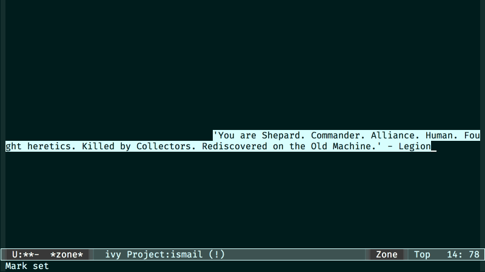

# zone-quotes

  

A zone program to display quotes from a specific collection

## Installation

### Manual

Save the file *zone-quotes.el* to disk and add the directory containing it to `load-path` using a command in your *.emacs* file like:

    (add-to-list 'load-path "~/.emacs.d/")

The above line assumes that you've placed the file into the Emacs directory '.emacs.d'.

Start the package with:

    (require 'zone-quotes)

### Marmalade

If you have Marmalade added as a repository to your Emacs, you can just install *zone-quotes* with

    M-x package-install zone-quotes RET

## Usage

Specify the quotes you want, to be shown while zoning out

    (zone-quotes-set-quotes (list "'I don't need luck. I have ammo.' - Grunt"
                                  "'Is submission not preferable to extinction?' - Saren"
                                  "'Having a bad day Shepard?' - Liara"))

Set `zone-pgm-quotes` as one of the zone programs

    (setq zone-programs
          [zone-pgm-quotes])

and activate zoning by specifying a delay

    (zone-when-idle 30)

Alternatively you can run `zone-quotes` directly

    (zone-quotes)
